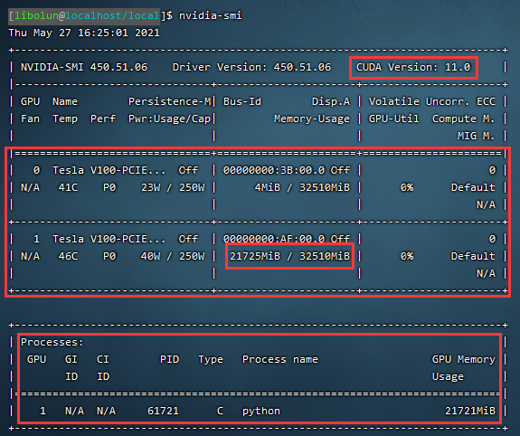

# GPU操作相关

- `nvidia-smi`  
  这是查看显卡信息的最基础的命令，它可以查看显卡的CUDA版本，显存使用情况，哪些进程在使用等信息。
    
  如图所示，从上到下一共三个大框。第一个框显示的是CUDA版本，版本号为11.0。第二个框显示的是两张显卡的使用情况，如子框所示
，子框表示的是显存一共使用了多少，图中显示32GB的显存占用了21GB。而第三个框为哪些进程占用了显存，可以看到，python这个进程
占用了21GB的显存。

- 限制显存占用  
如果你需要和同学同时使用显卡的时候，你们需要商量着分配显存，这时就用到了显存限制的功能了
  - PyTorch
    ```
    torch.cuda.set_per_process_memory_fraction(0.5, 0)
    ```
    参数1：fraction 限制的上限比例，0.5就是总GPU显存的一半，可以是0~1的任意float大小  
    参数2：device 设备号 0表示`cuda:0`
  - TensorFlow
    ```
    config = tf.ConfigProto()
    config.gpu_options.per_process_gpu_memory_fraction = 0.8  # 占用80%显存
    session = tf.Session(config=config)
    ```
