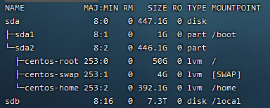
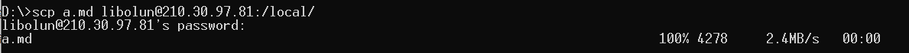
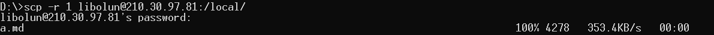
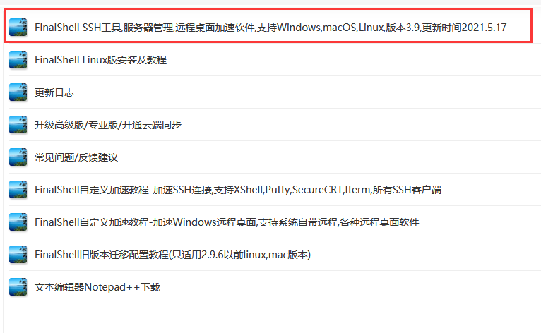
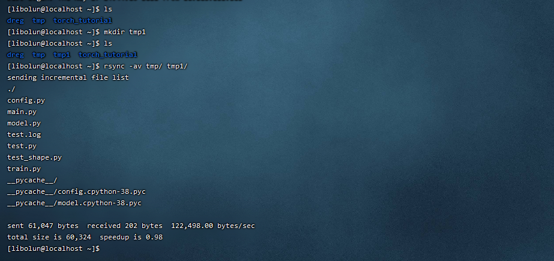
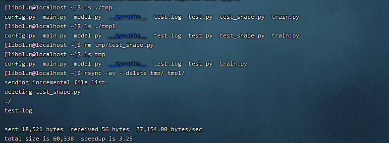
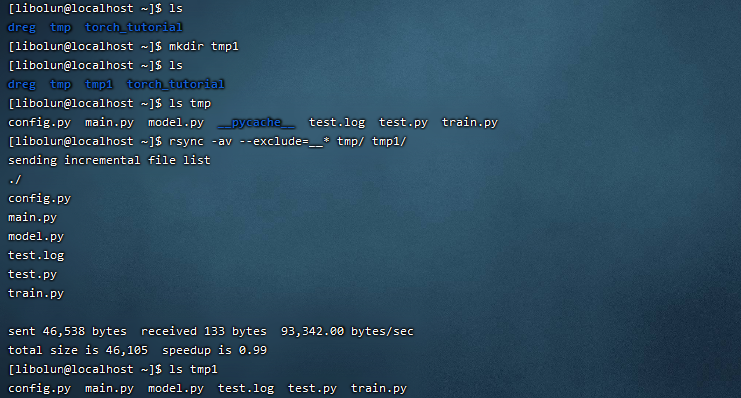

# LinuxServer 实验室服务器操作手册

## 账号申请方法
联系当期服务器管理员
TODO

## 服务器介绍
这是王忠老师的实验室服务器，暂时不允许私自提供给实验室外的人员使用。TODO
服务器配置如下：

|        DEVICE      |                      参数                    |
|:------------------:|:--------------------------------------------:|
|         CPU        |2*Inspur 2U Inter Xeon 4216(16C, 100W, 2.1GHz)|
|         GPU        |            2*NVIDIA Tesla V100-32GB          |
|         RAM        |                   4*32G DDR4                 |
|        Cache       |              730i Raid 0,1,5 w/1GB           |
| Node-local storage |               480GB SSD + 8T HDD             |

- CUDA版本为11.0，cuDNN版本为8.0.5
- pyTorch版本为1.8.1，TensorFlow版本为2.4.0
- Docker版本为20.10.6
- 可以使用Jupyter工作

## 使用规则
TODO

## 校内ssh方法
目前ip是校内分配的ip，校外是无法访问的。大工VPN目前也无法校外访问，校内政策如此。
现在的ip=210.30.97.81  
```
ssh username@210.30.97.81
```
第一次访问可能会有网络信任确认，这个时候你选择yes就会永久保存，以后访问便不会有这个提示。

## 文件系统
目前给每人分配在固态硬盘上的工作空间是2GB，如果使用比较庞大的数据集，请放在`/local`上，使用者请自行建立自己的目录，
`/local`目录下只允许创建带有你身份特征的文件夹，之后你可以在新建的文件夹下自由使用。具体例子如下图所示：  
  
硬盘结构如下图或者键入`lsblk`所示：  
  
- `sda` 为480GB固态硬盘，`sdb`为8T机械硬盘。
- `/home`为固态硬盘挂载的目录，即所有用户的工作目录。在这个目录下每个用户会分配以你的名字命名的文件夹和2GB的工作空间。你
  可以把程序、小容量数据集、配置文件存入你的工作空间里以更快地加载程序。
- `/local`为机械硬盘挂载的目录，目前所有用户均可以无限制使用，但请不要乱放你的文件。

## 安装

### 安装python-package
`pip install [--user/-u] package-name`  
默认安装在你的工作目录/.local下。

### 安装R
TODO

## 如何传输文件？
- `scp`  
  在本地cmd上，可以直接通过scp命令传输文件和文件夹。
  - 从本地上传到服务器
    ```
    scp [-r] {local_file_path} {username}@210.30.97.81:{file_path}
    ```
    例子：  
      
    如果想要把文件夹整个上传到服务器，那么加上参数`-r`即可。  
    例子：  
    
  - 从远程下载到本地
    ```
    scp [-r] {username}@210.30.97.81:{remote_file_path} {local_file_path}
    ```
    基本只是换一下顺序，效果和本地上传服务器一致。
  [更多使用信息](https://www.runoob.com/linux/linux-comm-scp.html)
- 使用ftp工具[FileZilla](https://www.filezilla.cn/download/client)传输  
  这个工具需要配置一下ssh，ssh的配置方法前面有说，
  [详见校内ssh方法](https://github.com/wzhy2000/LinuxServer#%E6%A0%A1%E5%86%85ssh%E6%96%B9%E6%B3%95)  
  之后便是整个文件系统的可视化界面，操作十分简单，就不再赘述。
- 使用shell工具传输  
  Windows自带的PowerShell也可以使用，这里推荐[FinalShell](https://www.hostbuf.com)，选择如图所示的链接。  
    
  然后选择你的操作系统对应的版本。  
  shell工具除了能够传输文件之外，还能够使用更加用户友好型的界面来进行服务器操作。配置好你的SSH之后你便可以开始使用。

## 如何备份数据？
```
rsync [-av|--delete|--exclude=PATTERN] {SRC} {DEST}
```
- `-a` 归档模式，递归模式传输文件，并保留所有文件属性。
- `-v` 打印信息，比如文件列表、文件数量。
- `--delete` 删除目标目录下源目录没有的文件。
- `--exclude=PATTERN` 排除不需要传输的文件。
- `SRC` 源目录
- `DEST` 目标目录

例子： 
  
注意：例子中使用的`SRC=tmp/`，加`/`的目的是为了把该目录下的所有文件备份至`tmp1/`目录下。所以`/`是很有必要的。

如果源目录下删除了一些文件，那么就需要用`--delete`来删除备份目录下冗余的文件。  
  

如果你想排除不想传输的文件，则使用`exclude=PATTERN`来备份。  



## 其他操作分区
- jupyter使用操作见[jupyter](https://github.com/wzhy2000/LinuxServer/tree/main/jupyter)
- screen操作见[screen](https://github.com/wzhy2000/LinuxServer/tree/main/screen)
- GPU操作见[GPU](https://github.com/wzhy2000/LinuxServer/tree/main/GPU)
- 多核并行程序写法见[parallel](https://github.com/wzhy2000/LinuxServer/tree/main/parallel)
仅管理员可用：
- 用户与用户组操作见[user_group](https://github.com/wzhy2000/LinuxServer/tree/main/administrator/user_group)
- 磁盘配额操作见[quota](https://github.com/wzhy2000/LinuxServer/tree/main/administrator/quota)
