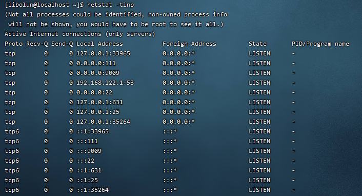

# 使用Jupyter工作吧！
服务器目前支持Jupyter进行工作，使用方法如下：
- 在打开Jupyter服务前，先检查端口是否被其他进程占用  
  ```
  netstat -tlnp
  ```
  查看监听端口，如下图所示  
    
  可以在`Local Address`栏下查看所有已经占用本地端口，比如第一行的`127.0.0.1:33965`中33965就是被占用的端口。
- 连接到服务端，键入`python -m jupyter notebook --no-browser --port={port}` 打开jupyter内核服务，`port`选用第一步不会冲突的端口。
  
- 在本地cmd下，键入`ssh -N -L 8080:localhost:{port} {username}@{ip}` 意思是不执行远程命令并且将服务器端口转发到本地端口8080，你也可以自行设置转发到本地的端口号。  
  
- 在本地浏览器下，`localhost:8080`就可以开始使用Jupyter了，具体的jupyter使用规则不再赘述。
  

如何正确关闭Jupyter
- Jupyter页面右上角的quit，点击
  
- 在服务端，`python -m jupyter notebook stop {port}`
- 在本地cmd远程关闭，`ssh {username}@{ip} "pkill -u {username} jupyter"`
- 管理员远程强制，`ssh {username}@{ip} "jupyter notebook stop {port}"`