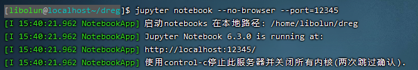
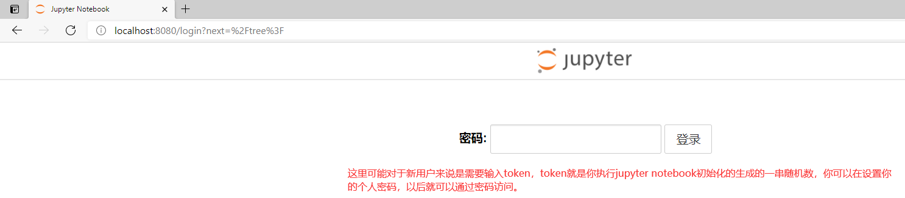

# 使用Jupyter工作吧！
服务器目前支持jupyter进行工作，使用方法如下：
- 连接到服务端，`python -m jupyter notebook --no-browser --port={port}` 打开jupyter内核服务
  TODO port冲突 netstat -tlnp 查看监听端口
  
- TODO clearly 在cmd下，`ssh -N -L 8080:localhost:{port} {username}@{ip}` 不执行远程命令并且将服务器端口转发到本地端口8080，你也可
以自行设置。  
  
- 在本地浏览器下，`localhost:8080`就可以开始使用Jupyter了
具体的jupyter使用规则不再赘述。
  

如何正确关闭Jupyter
- Jupyter页面右上角的quit，点击
- 在服务器命令行，`python -m jupyter notebook stop {port}`
  
- 远程命令，`ssh {username}@{ip} "pkill -u {username} jupyter"`
- 管理员远程命令，`ssh {username}@{ip} "jupyter notebook stop {port}"`