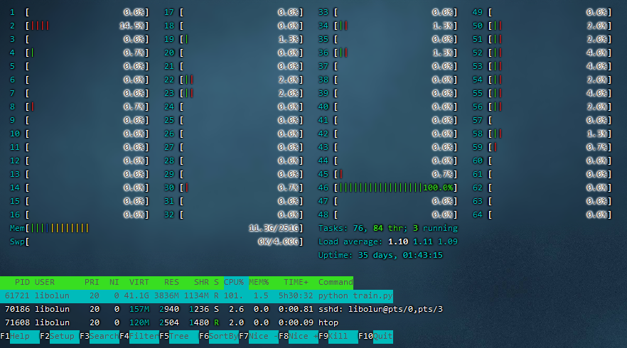

# 多核并行操作相关
如果你执行的只是很小的程序，可能单核便能满足你的要求。但是如果你要运行很大的数据类型，比如生物信息学，比如图像的预处理等，
这些如果单核处理起来会非常废时间，这个时候就需要使用CPU的多核并行技术来提升效率。
使用`htop`命令就可以看到服务器的核运行情况。
  
可以看出，64核的CPU很多核都没有利用起来。

## Python多核并行
Python默认的多进程、多线程库`multiprocessing and threading`很好用，如果你用的是Python默认的解析器(CPython)，那么你只能放弃使用`threading`库，因为GIL的存在，多线程会让你的Python程序跑的比单线程还慢。当然，如果你使用的是JPython解析器，或者说你的解析器没有GIL对你程序的影响，那么你可以尝试去使用多线程。[更多信息](http://cenalulu.github.io/python/gil-in-python/)

那么这里只讲述Python库`multiprocessing`。  
讲怎么使用之前，需要先明确一个概念。由于`multiprocessing`是一个创建多进程的库，那么如果你要调用的函数在同一个`.py`文件下运行的话是不可以的，你分配给进程的函数需要通过`import`导入。例如：  
```
import multiprocessing
def f(x):
    return x ** 2
pool = multiprocessing.Pool(processes=5)
y = range(5)
print(pool.map(f, y))
```
上述程序是不能跑的，因为要调用的函数和pool的创建在同一个进程中。正确做法应该是：
```
import multiprocessing
def f(x):
    return x ** 2
if __name__ == '__main__':
    pool = multiprocessing.Pool(processes=5)
    y = range(5)
    print(pool.map(f, y))
```
或者：
```
import multiprocessing
from fx import f
pool = multiprocessing.Pool(processes=5)
y = range(5)
print(pool.map(f, y))   # [0, 1, 4, 9, 16]
```
这样做的目的是为了进程安全，[更多信息](https://docs.python.org/3/library/multiprocessing.html#multiprocessing-programming)  
那么，明确了这个问题之后，开始讲一下`multiprocessing`如何使用。  
### `Pool`对象
Python提供了非常简单的`Pool`对象来实现进程池。
```
pool = multiprocessing.Pool(processes=5)    # 创建进程池，并且容纳上限为5个进程。
```
而`pool.map(f, y)`是对可迭代对象`y`的每个对象均使用一次`f`函数，并返回每次执行后的数据列表。
与`pool.map()`相似的还有`pool.imap()`和`pool.imap_unordered()`，不同的是后面两个返回的都是迭代器，而最后一个和名字一样，返回的数据是无序的。

### `Process`对象
接下来看下面一个例子：
```
import os
import multiprocessing

# Main
print('Main:', os.getpid())


# worker function
def worker(sign, lock):
    lock.acquire()
    print(sign, os.getpid())
    lock.release()


# Multi-process
record = []
lock = multiprocessing.Lock()

if __name__ == '__main__':
    for i in range(5):
        process = multiprocessing.Process(target=worker, args=('process', lock))    # 创建进程对象，把和参数('process', lock)赋给函数worker并且让进程执行worker
        process.start() # 启动进程
        record.append(process)

    for process in record:
        process.join()  # 这里可以填入参数，效果为阻塞多少秒，如果为None那么就是终止进程。
```
output:
```
Main: 96217
process 96300
process 96301
process 96302
process 96303
process 96304
```
这是创建进程对象并且让他自己打印自己的PID，为了防止输出的数据是乱序的，这里加了一把进程锁`lock = multiprocessing.Lock()`，只有拿到锁的进程才能够打印自己的PID。  
### `Pipe`和`Queue`：  
和名字一样，分别对应操作系统中的管道和消息队列。看两个例子：
```
import multiprocessing as mul


def proc1(pipe):
    pipe.send('hello')
    print('proc1 rec:', pipe.recv())


def proc2(pipe):
    print('proc2 rec:', pipe.recv())
    pipe.send('hello, too')


# Build a pipe
pipe = mul.Pipe()
if __name__ == '__main__':
    # Pass an end of the pipe to process 1
    p1 = mul.Process(target=proc1, args=(pipe[0],))
    # Pass the other end of the pipe to process 2
    p2 = mul.Process(target=proc2, args=(pipe[1],))
    p1.start()
    p2.start()
    p1.join()
    p2.join()
```
output:
```
proc2 rec: hello
proc1 rec: hello, too
```
Pipe对象建立的时候，返回一个含有两个元素的表，每个元素代表Pipe的一端(Connection对象)。我们对Pipe的某一端调用`send()`方法来传送对象，在另一端使用`recv()`来接收。  
```
import os
import multiprocessing
import time

def inputQ(queue):
    info = str(os.getpid()) + '(put):' + str(time.time())
    queue.put(info)

def outputQ(queue,lock):
    info = queue.get()
    lock.acquire()
    print (str(os.getpid()) + ' get: ' + info)
    lock.release()
    
record1 = []   # store input processes
record2 = []   # store output processes
lock  = multiprocessing.Lock()    # To prevent messy print
queue = multiprocessing.Queue(3)

if __name__ == '__main__':
    # input processes
    for i in range(10):
        process = multiprocessing.Process(target=inputQ,args=(queue,))
        process.start()
        record1.append(process)
    
    # output processes
    for i in range(10):
        process = multiprocessing.Process(target=outputQ,args=(queue,lock))
        process.start()
        record2.append(process)
    
    for p in record1:
        p.join()
    
    queue.close()  # No more object will come, close the queue
    
    for p in record2:
        p.join()
```
一些进程使用`put()`在Queue中放入字符串，这个字符串中包含PID和时间。另一些进程从Queue中取出，并打印自己的PID以及`get()`的字符串。


## R多核并行
TODO