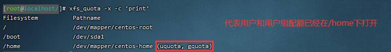
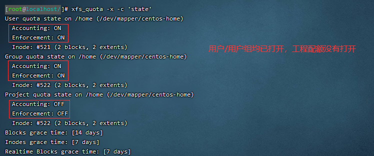
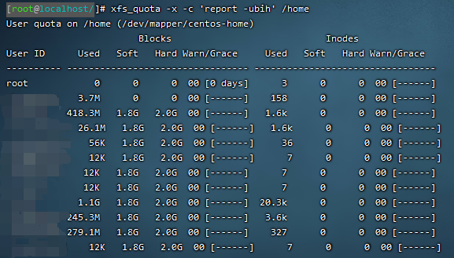
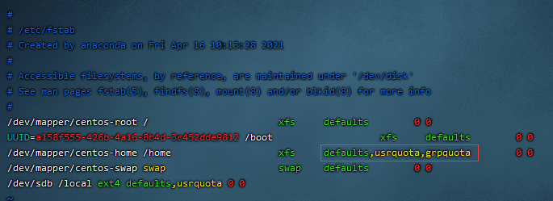

# 磁盘配额
`quota`是早期linux针对ext家族设计的，这种文件系统的配额主要是针对整个文件系统做处理，所以大多针对挂载点设计。
新的xfs支持project模式，这样就能针对个别目录来进行磁盘配额。  
服务器的`/home`属于xfs文件格式，需要使用`xfs_quota`命令来进行配额操作。下面的命令皆使用在`/home`目录, `xfs`文件系统下。
传统ext文件系统暂时没用上，网上可查，就不在该文档写了。  

## 查看文件系统状态
`xfs_quota -x -c 'print'`  
如果看到某个文件系统的路径名后有括号标注的`(uquota, gquota/pquota)`，证明(用户配额，用户组配额
/目录配额)的标记在这个文件系统是存在的(不一定是打开，且其中gquota/pquota只能同时存在一个)。如果没有该标注，需要重新挂载
磁盘并且启用quota支持，详细见重挂载并启用quota。

## 查看文件系统配额是否打开
`xfs_quota -x -c 'state'`  
可以看到，`User quota state on /home`下，`Accounting: ON`表示`user quota`即用户配额是启动状态
的，如果`Accounting: OFF`表示就是关闭的状态。

## 查看文件系统配额情况
`xfs_quota -x -c "report -ubih" /home` `hard`就是最大限额，`soft`只是用户超过这个额度就会报警，但仍可以继续使用至`hard`

## 对用户启用配额
`xfs_quota -x -c "limit -u bsoft=1800M bhard=2000M username" /home`，如果有要求配额索引节点，则类似块节点`bsoft/bhard`
同样的方法，增加`isoft/ihard=?`即可。

## 对用户组启用配额
`xfs_quota -x -c "limit -g bsoft=18G bhard=20G groupname" /home`

## 修改宽限时间
`xfs_quota -x -c "timer -b -u 14days" /home` 宽限时间是如果用户空间超过soft的限额，则会经过宽限时间后把soft设置成hard，
并且禁止用户新增数据。

## 测试
`su username` 切换用户  
`dd if=/dev/zero of=/home/username/123.img bs=1M count=1900` 生成1.9G大小的图片  
`dd if=/dev/zero of=/home/username/123.img bs=1M count=2100` 生成2.1G大小的图片  

## 重挂载并启用quota
如果xfs文件系统没有启用quota，那么`xfs_quota -x -c 'print'`打印的文件系统后是没有`(uquota, gquota/pquota)`的。那么就需要
启用xfs文件系统的quota功能。
- 启用quota
    - 临时 `mount -o remount,usrquota,grpquota/prjquota /home`
    - 永久 `vim /etc/fstab`，在`/home`文件系统`default`后添加`,usrquota,grpquota/prjquota`
      再重新挂载`/home`
      
    这时候使用`xfs_quota -x -c 'print'`打印看是否成功，如果没有就需要卸载`/home`再重新挂载。如果遇到有用户的进程在使用
    设备(device is busy)，少的话可以按`pid`杀死，多的话就使用`killall -u username`